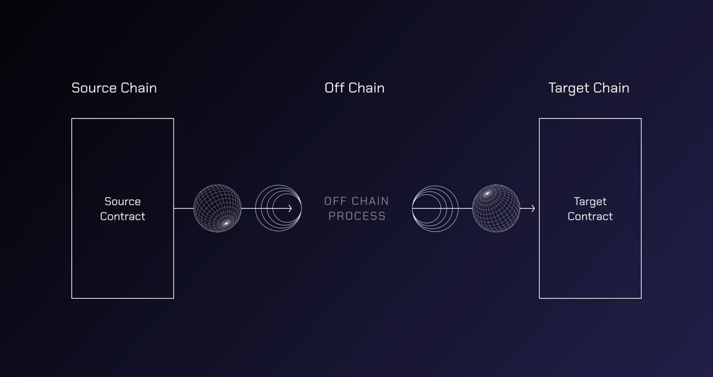

# Introduction

Wormhole is a generic **message passing protocol** that enables communication between blockchains.


The above is an _oversimplified_ illustration of the protocol, details about the architecture and components are available [here](./reference/components/README.md)


This simple **message passing protocol** enables developers and users of [cross chain applications](./reference/glossary.md#xdapps) built by developers to leverage the advantages of multiple ecosystems.

### What Isn't Wormhole?

Wormhole is _not_ a blockchain itself, it provides a means of communication between blockchains or rollups.

Wormhole is _not_ a token bridge, though there are [protocols built on Wormhole](https://www.portalbridge.com/#/transfer) that serve this purpose.

### What can Wormhole be used for?

Consider the following examples of potential applications that are now possible with Wormhole:

1. **Cross Chain Exchange**: Using [Wormhole Connect](./tutorials/quick-start/wh-connect.md), a developer can build an exchange that allows deposits from any Wormhole connected chain, massively increasing the liquidity their users can access.
2. **Cross Chain Governance**: If a group of NFT collections on different networks wanted their holders to vote on a combined proposal, they could pick a "voting" chain, and use Wormhole to communicate votes cast on their disparate chains to the voting chain.
3. **Cross Chain Game**: A game could be built and played on a performant network like Solana, and it's rewards issued as NFTs on a different network, for example Ethereum.

## Get Started

### Quick Start Tutorials

Tutorials are available to get started quickly and explain the concepts involved.

<table data-card-size="large" data-view="cards" data-full-width="false"><thead><tr><th></th><th></th><th data-hidden data-card-target data-type="content-ref"></th><th data-hidden data-card-cover data-type="files"></th></tr></thead><tbody><tr><td><strong>Quick Start</strong> - Off Chain</td><td>Integrate Wormhole Connect to a new or existing web UI</td><td><a href="./tutorials/quick-start/wormhole-connect/wh-connect.md">wh-connect.md</a></td><td><a href=".gitbook/assets/wh-connect-default.png">wh-connect-default.png</a></td></tr><tr><td><strong>Quick Start</strong> - On Chain</td><td>Send your first cross chain message</td><td><a href="./tutorials/quick-start/cross-chain-dev/README.md">cross-chain-dev</a></td><td><a href=".gitbook/assets/wh-line-art.png">wh-line-art.png</a></td></tr></tbody></table>

More tutorials are available [here](./tutorials/quick-start/README.md).

### Explore

Find out more about the Wormhole ecosystem, components, and protocols.

<table data-card-size="large" data-view="cards" data-full-width="false"><thead><tr><th></th><th></th><th data-hidden data-card-target data-type="content-ref"></th><th data-hidden data-card-cover data-type="files"></th></tr></thead><tbody><tr><td><strong>Architecture</strong></td><td>Dig into the components of the protocol</td><td><a href="./reference/components/README.md">components.md</a></td><td><a href=".gitbook/assets/detailed-flow.jpg">detailed-flow.jpg</a></td></tr><tr><td><strong>Protocol Specifications</strong></td><td>Find out more about the protocols built on top of Wormhole</td><td><a href="https://github.com/wormhole-foundation/wormhole/tree/main/whitepapers">https://github.com/wormhole-foundation/wormhole/tree/main/whitepapers</a></td><td><a href=".gitbook/assets/protocols.png">protocols.png</a></td></tr></tbody></table>

### Demos

Demos provide more realistic implementations than Tutorials

<table data-card-size="large" data-view="cards" data-full-width="false"><thead><tr><th></th><th></th><th data-hidden data-card-target data-type="content-ref"></th><th data-hidden data-card-cover data-type="files"></th></tr></thead><tbody><tr><td><strong>Wormhole Scaffolding</strong></td><td>Quickly spin up a project with the Scaffolding repo</td><td><a href="https://github.com/wormhole-foundation/wormhole-scaffolding">https://github.com/wormhole-foundation/wormhole-scaffolding</a></td><td><a href=".gitbook/assets/scaffolding.jpg">scaffolding.jpg</a></td></tr><tr><td><strong>xDapp book projects</strong></td><td>Run and learn from example programs</td><td><a href="https://github.com/wormhole-foundation/xdapp-book/tree/main/projects">https://github.com/wormhole-foundation/xdapp-book/tree/main/projects</a></td><td><a href=".gitbook/assets/projects.png">projects.png</a></td></tr></tbody></table>

More Demos are available [here](./tutorials/demos.md).



## Wormhole integration complete?

Let us know so we can list your project in our ecosystem directory and introduce you to our global, multichain community!

[Reach out now!](https://forms.clickup.com/45049775/f/1aytxf-10244/JKYWRUQ70AUI99F32Q)



## Supported Blockchains

Wormhole supports a growing number of blockchains

<table data-view="cards" data-full-width="false"><thead><tr><th></th><th data-hidden data-card-target data-type="content-ref"></th><th data-hidden data-card-cover data-type="files"></th></tr></thead><tbody>

<!--SUPPORTED_BLOCKCHAIN_CARDS-->
<tr>
    <td><strong>Acala</strong></td>
    <td><a href="./blockchain-environments/evm/README.md#acala">evm</a></td>
    <td><a href="./.gitbook/assets/chain-icons/acala.svg">acala</a></td>
</tr>
<tr>
    <td><strong>Algorand</strong></td>
    <td><a href="./blockchain-environments/algorand/README.md#algorand">algorand</a></td>
    <td><a href="./.gitbook/assets/chain-icons/algorand.svg">algorand</a></td>
</tr>
<tr>
    <td><strong>Aptos</strong></td>
    <td><a href="./blockchain-environments/aptos/README.md#aptos">aptos</a></td>
    <td><a href="./.gitbook/assets/chain-icons/aptos.svg">aptos</a></td>
</tr>
<tr>
    <td><strong>Arbitrum</strong></td>
    <td><a href="./blockchain-environments/evm/README.md#arbitrum">evm</a></td>
    <td><a href="./.gitbook/assets/chain-icons/arbitrum.svg">arbitrum</a></td>
</tr>
<tr>
    <td><strong>Arbitrum Sepolia</strong></td>
    <td><a href="./blockchain-environments/evm/README.md#arbitrum_sepolia">evm</a></td>
    <td><a href="./.gitbook/assets/chain-icons/arbitrum_sepolia.svg">arbitrum_sepolia</a></td>
</tr>
<tr>
    <td><strong>Avalanche</strong></td>
    <td><a href="./blockchain-environments/evm/README.md#avalanche">evm</a></td>
    <td><a href="./.gitbook/assets/chain-icons/avalanche.svg">avalanche</a></td>
</tr>
<tr>
    <td><strong>Base</strong></td>
    <td><a href="./blockchain-environments/evm/README.md#base">evm</a></td>
    <td><a href="./.gitbook/assets/chain-icons/base.svg">base</a></td>
</tr>
<tr>
    <td><strong>Base Sepolia</strong></td>
    <td><a href="./blockchain-environments/evm/README.md#base_sepolia">evm</a></td>
    <td><a href="./.gitbook/assets/chain-icons/base_sepolia.svg">base_sepolia</a></td>
</tr>
<tr>
    <td><strong>Berachain</strong></td>
    <td><a href="./blockchain-environments/evm/README.md#berachain">evm</a></td>
    <td><a href="./.gitbook/assets/chain-icons/berachain.svg">berachain</a></td>
</tr>
<tr>
    <td><strong>Blast</strong></td>
    <td><a href="./blockchain-environments/evm/README.md#blast">evm</a></td>
    <td><a href="./.gitbook/assets/chain-icons/blast.svg">blast</a></td>
</tr>
<tr>
    <td><strong>BNB Smart Chain</strong></td>
    <td><a href="./blockchain-environments/evm/README.md#bsc">evm</a></td>
    <td><a href="./.gitbook/assets/chain-icons/bsc.svg">bsc</a></td>
</tr>
<tr>
    <td><strong>Celestia</strong></td>
    <td><a href="./blockchain-environments/cosmwasm/README.md#celestia">cosmwasm</a></td>
    <td><a href="./.gitbook/assets/chain-icons/celestia.svg">celestia</a></td>
</tr>
<tr>
    <td><strong>Celo</strong></td>
    <td><a href="./blockchain-environments/evm/README.md#celo">evm</a></td>
    <td><a href="./.gitbook/assets/chain-icons/celo.svg">celo</a></td>
</tr>
<tr>
    <td><strong>Cosmoshub</strong></td>
    <td><a href="./blockchain-environments/cosmwasm/README.md#cosmoshub">cosmwasm</a></td>
    <td><a href="./.gitbook/assets/chain-icons/cosmoshub.svg">cosmoshub</a></td>
</tr>
<tr>
    <td><strong>Dymension</strong></td>
    <td><a href="./blockchain-environments/cosmwasm/README.md#dymension">cosmwasm</a></td>
    <td><a href="./.gitbook/assets/chain-icons/dymension.svg">dymension</a></td>
</tr>
<tr>
    <td><strong>Ethereum</strong></td>
    <td><a href="./blockchain-environments/evm/README.md#ethereum">evm</a></td>
    <td><a href="./.gitbook/assets/chain-icons/ethereum.svg">ethereum</a></td>
</tr>
<tr>
    <td><strong>Evmos</strong></td>
    <td><a href="./blockchain-environments/cosmwasm/README.md#evmos">cosmwasm</a></td>
    <td><a href="./.gitbook/assets/chain-icons/evmos.svg">evmos</a></td>
</tr>
<tr>
    <td><strong>Fantom</strong></td>
    <td><a href="./blockchain-environments/evm/README.md#fantom">evm</a></td>
    <td><a href="./.gitbook/assets/chain-icons/fantom.svg">fantom</a></td>
</tr>
<tr>
    <td><strong>Gnosis</strong></td>
    <td><a href="./blockchain-environments/evm/README.md#gnosis">evm</a></td>
    <td><a href="./.gitbook/assets/chain-icons/gnosis.svg">gnosis</a></td>
</tr>
<tr>
    <td><strong>Ethereum Holesky</strong></td>
    <td><a href="./blockchain-environments/evm/README.md#holesky">evm</a></td>
    <td><a href="./.gitbook/assets/chain-icons/holesky.svg">holesky</a></td>
</tr>
<tr>
    <td><strong>Injective</strong></td>
    <td><a href="./blockchain-environments/cosmwasm/README.md#injective">cosmwasm</a></td>
    <td><a href="./.gitbook/assets/chain-icons/injective.svg">injective</a></td>
</tr>
<tr>
    <td><strong>Karura</strong></td>
    <td><a href="./blockchain-environments/evm/README.md#karura">evm</a></td>
    <td><a href="./.gitbook/assets/chain-icons/karura.svg">karura</a></td>
</tr>
<tr>
    <td><strong>Klaytn</strong></td>
    <td><a href="./blockchain-environments/evm/README.md#klaytn">evm</a></td>
    <td><a href="./.gitbook/assets/chain-icons/klaytn.svg">klaytn</a></td>
</tr>
<tr>
    <td><strong>Kujira</strong></td>
    <td><a href="./blockchain-environments/cosmwasm/README.md#kujira">cosmwasm</a></td>
    <td><a href="./.gitbook/assets/chain-icons/kujira.svg">kujira</a></td>
</tr>
<tr>
    <td><strong>Linea</strong></td>
    <td><a href="./blockchain-environments/evm/README.md#linea">evm</a></td>
    <td><a href="./.gitbook/assets/chain-icons/linea.svg">linea</a></td>
</tr>
<tr>
    <td><strong>Mantle</strong></td>
    <td><a href="./blockchain-environments/evm/README.md#mantle">evm</a></td>
    <td><a href="./.gitbook/assets/chain-icons/mantle.svg">mantle</a></td>
</tr>
<tr>
    <td><strong>Moonbeam</strong></td>
    <td><a href="./blockchain-environments/evm/README.md#moonbeam">evm</a></td>
    <td><a href="./.gitbook/assets/chain-icons/moonbeam.svg">moonbeam</a></td>
</tr>
<tr>
    <td><strong>NEAR</strong></td>
    <td><a href="./blockchain-environments/near/README.md#near">near</a></td>
    <td><a href="./.gitbook/assets/chain-icons/near.svg">near</a></td>
</tr>
<tr>
    <td><strong>Neon</strong></td>
    <td><a href="./blockchain-environments/evm/README.md#neon">evm</a></td>
    <td><a href="./.gitbook/assets/chain-icons/neon.svg">neon</a></td>
</tr>
<tr>
    <td><strong>Neutron</strong></td>
    <td><a href="./blockchain-environments/cosmwasm/README.md#neutron">cosmwasm</a></td>
    <td><a href="./.gitbook/assets/chain-icons/neutron.svg">neutron</a></td>
</tr>
<tr>
    <td><strong>Oasis</strong></td>
    <td><a href="./blockchain-environments/evm/README.md#oasis">evm</a></td>
    <td><a href="./.gitbook/assets/chain-icons/oasis.svg">oasis</a></td>
</tr>
<tr>
    <td><strong>Optimism</strong></td>
    <td><a href="./blockchain-environments/evm/README.md#optimism">evm</a></td>
    <td><a href="./.gitbook/assets/chain-icons/optimism.svg">optimism</a></td>
</tr>
<tr>
    <td><strong>Optimism Sepolia</strong></td>
    <td><a href="./blockchain-environments/evm/README.md#optimism_sepolia">evm</a></td>
    <td><a href="./.gitbook/assets/chain-icons/optimism_sepolia.svg">optimism_sepolia</a></td>
</tr>
<tr>
    <td><strong>Osmosis</strong></td>
    <td><a href="./blockchain-environments/cosmwasm/README.md#osmosis">cosmwasm</a></td>
    <td><a href="./.gitbook/assets/chain-icons/osmosis.svg">osmosis</a></td>
</tr>
<tr>
    <td><strong>Polygon</strong></td>
    <td><a href="./blockchain-environments/evm/README.md#polygon">evm</a></td>
    <td><a href="./.gitbook/assets/chain-icons/polygon.svg">polygon</a></td>
</tr>
<tr>
    <td><strong>Polygon Sepolia</strong></td>
    <td><a href="./blockchain-environments/evm/README.md#polygon_sepolia">evm</a></td>
    <td><a href="./.gitbook/assets/chain-icons/polygon_sepolia.svg">polygon_sepolia</a></td>
</tr>
<tr>
    <td><strong>Provenance</strong></td>
    <td><a href="./blockchain-environments/cosmwasm/README.md#provenance">cosmwasm</a></td>
    <td><a href="./.gitbook/assets/chain-icons/provenance.svg">provenance</a></td>
</tr>
<tr>
    <td><strong>Pythnet</strong></td>
    <td><a href="./blockchain-environments/solana/README.md#pythnet">solana</a></td>
    <td><a href="./.gitbook/assets/chain-icons/pythnet.svg">pythnet</a></td>
</tr>
<tr>
    <td><strong>Rootstock</strong></td>
    <td><a href="./blockchain-environments/evm/README.md#rootstock">evm</a></td>
    <td><a href="./.gitbook/assets/chain-icons/rootstock.svg">rootstock</a></td>
</tr>
<tr>
    <td><strong>Scroll</strong></td>
    <td><a href="./blockchain-environments/evm/README.md#scroll">evm</a></td>
    <td><a href="./.gitbook/assets/chain-icons/scroll.svg">scroll</a></td>
</tr>
<tr>
    <td><strong>Seda</strong></td>
    <td><a href="./blockchain-environments/cosmwasm/README.md#seda">cosmwasm</a></td>
    <td><a href="./.gitbook/assets/chain-icons/seda.svg">seda</a></td>
</tr>
<tr>
    <td><strong>Sei</strong></td>
    <td><a href="./blockchain-environments/cosmwasm/README.md#sei">cosmwasm</a></td>
    <td><a href="./.gitbook/assets/chain-icons/sei.svg">sei</a></td>
</tr>
<tr>
    <td><strong>Seievm</strong></td>
    <td><a href="./blockchain-environments/evm/README.md#seievm">evm</a></td>
    <td><a href="./.gitbook/assets/chain-icons/seievm.svg">seievm</a></td>
</tr>
<tr>
    <td><strong>Ethereum Sepolia</strong></td>
    <td><a href="./blockchain-environments/evm/README.md#sepolia">evm</a></td>
    <td><a href="./.gitbook/assets/chain-icons/sepolia.svg">sepolia</a></td>
</tr>
<tr>
    <td><strong>Solana</strong></td>
    <td><a href="./blockchain-environments/solana/README.md#solana">solana</a></td>
    <td><a href="./.gitbook/assets/chain-icons/solana.svg">solana</a></td>
</tr>
<tr>
    <td><strong>Stargaze</strong></td>
    <td><a href="./blockchain-environments/cosmwasm/README.md#stargaze">cosmwasm</a></td>
    <td><a href="./.gitbook/assets/chain-icons/stargaze.svg">stargaze</a></td>
</tr>
<tr>
    <td><strong>Sui</strong></td>
    <td><a href="./blockchain-environments/sui/README.md#sui">sui</a></td>
    <td><a href="./.gitbook/assets/chain-icons/sui.svg">sui</a></td>
</tr>
<tr>
    <td><strong>Terra</strong></td>
    <td><a href="./blockchain-environments/cosmwasm/README.md#terra">cosmwasm</a></td>
    <td><a href="./.gitbook/assets/chain-icons/terra.svg">terra</a></td>
</tr>
<tr>
    <td><strong>Terra2</strong></td>
    <td><a href="./blockchain-environments/cosmwasm/README.md#terra2">cosmwasm</a></td>
    <td><a href="./.gitbook/assets/chain-icons/terra2.svg">terra2</a></td>
</tr>
<tr>
    <td><strong>Xlayer</strong></td>
    <td><a href="./blockchain-environments/evm/README.md#xlayer">evm</a></td>
    <td><a href="./.gitbook/assets/chain-icons/xlayer.svg">xlayer</a></td>
</tr>
<tr>
    <td><strong>Xpla</strong></td>
    <td><a href="./blockchain-environments/cosmwasm/README.md#xpla">cosmwasm</a></td>
    <td><a href="./.gitbook/assets/chain-icons/xpla.svg">xpla</a></td>
</tr>
<!--SUPPORTED_BLOCKCHAIN_CARDS-->

</tbody></table>
