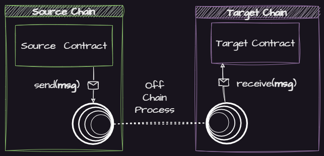

Wormhole is a generic **message passing protocol** that enables communication between blockchains.


The above is an _oversimplified_ illustration of the protocol, details about the architecture and components are available [here](./reference/components/README.md)


This simple **message passing protocol** enables developers and users of [cross chain applications](./reference/glossary.md#xdapps) built by developers to leverage the advantages of multiple ecosystems. 

## What Isn't Wormhole?

Wormhole is _not_ a blockchain itself, it provides a means of communication between blockchains or rollups.

Wormhole is _not_ a token bridge, though there are [protocols built on Wormhole](https://www.portalbridge.com/#/transfer) that serve this purpose.

## What can Wormhole be used for?

Consider the following examples of potential applications that are now possible with Wormhole:

1. **Cross Chain Exchange**: Using [Wormhole Connect](./tutorials/quick-start/wh-connect.md), a developer can build an exchange that allows deposits from any Wormhole connected chain, massively increasing the liquidity their users can access.
2. **Cross Chain Governance**: If a group of NFT collections on different networks wanted their holders to vote on a combined proposal, they could pick a "voting" chain, and use Wormhole to communicate votes cast on their disparate chains to the voting chain.
3. **Cross Chain Game**: A game could be built and played on a performant network like Solana, and it's rewards issued as NFTs on a different network, for example Ethereum.

# Get Started 

## Quick Start Tutorials

Tutorials are available to get started quickly and explain the concepts involved.

<table data-view="cards" data-card-size="large" data-full-width="false">
   <thead>
      <tr>
         <th></th>
         <th></th>
         <th data-hidden data-card-target data-type="content-ref"></th>
         <th data-hidden data-card-cover data-type="files"></th>
      </tr>
   </thead>
    <tbody>
        <tr>
            <td><strong>Quick Start</strong> - Off Chain</td>
            <td>Integrate Wormhole Connect to a new or existing web UI</td>
            <td><a href="./tutorials/quick-start/wh-connect.md">wh-connect.md</a></td>
            <td><a href=".gitbook/assets/wh-connect-default.png">wh-connect-default.png</a></td>
        </tr>
        <tr>
            <td><strong>Quick Start</strong> - On Chain</td>
            <td>Send your first cross chain message</td>
            <td><a href="./quick-start/cross-chain-dev.md">cross-chain-dev.md</a></td>
            <td><a href=".gitbook/assets/wh-line-art.png">wh-line-art.png</a></td>
        </tr>
    </tbody>
</table>

More tutorials are available [here](./tutorials/README.md).

## Explore 

Find out more about the Wormhole ecosystem, components, and protocols.

<table data-view="cards" data-card-size="large" data-full-width="false">
   <thead>
      <tr>
         <th></th>
         <th></th>
         <th data-hidden data-card-target data-type="content-ref"></th>
         <th data-hidden data-card-cover data-type="files"></th>
      </tr>
   </thead>
    <tbody>
        <tr>
            <td><strong>Architecture</strong></td>
            <td>Dig into the components of the protocol</td>
            <td><a href="./reference/components/README.md">components</a></td>
            <td><a href=".gitbook/assets/core-concepts/detailed-flow.png">detailed-flow.png</a></td>
        </tr>
        <tr>
            <td><strong>Protocol Specifications</strong></td>
            <td>Find out more about the protocols built on top of Wormhole</td>
            <td><a href="https://github.com/wormhole-foundation/wormhole/tree/main/whitepapers">white papers</a></td>
            <td><a href=".gitbook/assets/protocols.png">wormhole-blue.svg</a></td>
        </tr>
    </tbody>
</table>

## Demos

Demos provide more realistic implementations than Tutorials

<table data-view="cards" data-card-size="large" data-full-width="false">
   <thead>
      <tr>
         <th></th>
         <th></th>
         <th data-hidden data-card-target data-type="content-ref"></th>
         <th data-hidden data-card-cover data-type="files"></th>
      </tr>
   </thead>
    <tbody>
        <tr>
            <td><strong>Wormhole Scaffolding</strong></td>
            <td>Quickly spin up a project with the Scaffolding repo</td>
            <td><a href="https://github.com/wormhole-foundation/wormhole-scaffolding">wormhole-scaffolding</a></td>
            <td><a href=".gitbook/assets/scaffolding.jpg">scaffolding.jpg</a></td>
        </tr>
        <tr>
            <td><strong>xDapp book projects</strong></td>
            <td>Run and learn from example programs</td>
            <td><a href="https://github.com/wormhole-foundation/xdapp-book/tree/main/projects">xdapp-projects</a></td>
            <td><a href=".gitbook/assets/projects.png">project.png</a></td>
        </tr>
    </tbody>
</table>

More Demos are available [here](./demos.md).

<!-- 

# Supported Blockchains

Wormhole supports a growing number of blockchains

<table data-view="cards" data-full-width="false">
   <thead>
      <tr>
         <th></th>
         <th data-hidden data-card-target data-type="content-ref"></th>
         <th data-hidden data-card-cover data-type="files"></th>
      </tr>
   </thead>
   <tbody>
</tbody></table>
-->
