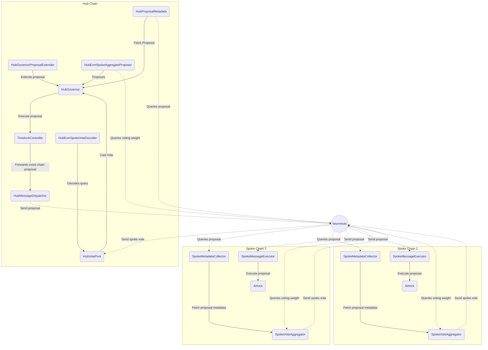

# Architecture

MultiGov employs a hub-and-spoke model to enable cross-chain governance, utilizing Wormhole's interoperability infrastructure for secure cross-chain communication. This architecture allows for coordinated decision-making across multiple blockchain networks while maintaining a central point of coordination.

## Key Components

### **Hub Chain**:
   - **`HubGovernor`**: Central governance contract managing proposals and vote tallying.
   - **`HubVotePool`**: Receives aggregated votes from spokes and submits them to `HubGovernor`.
   - **`HubMessageDispatcher`**: Relays approved proposal executions to spoke chains.
   - **`HubProposalExtender`**: Allows trusted actors to extend voting periods if needed.
   - **`HubProposalMetadata`**: Helper contract returning proposalId and vote start for `HubGovernor` proposals.
   - **`HubEvmSpokeAggregateProposer`**: Aggregates cross-chain voting weight for an address and proposes via the `HubGovernor` if eligible.

### **Spoke Chains**:
   - **`SpokeVoteAggregator`**: Collects votes on the spoke chain and forwards them to the hub.
   - **`SpokeMessageExecutor`**: Receives and executes approved proposals from the hub.
   - **`SpokeMetadataCollector`**: Fetches proposal metadata from the hub for spoke chain voters.
   - **`SpokeAirlock`**: Acts as governance's "admin" on the spoke, has permissions and its own treasury.

## System Workflow

1. **Proposal Creation**:
   - A user creates a proposal through the `HubEvmSpokeAggregateProposer`, which checks eligibility across chains, or directly on the `HubGovernor` via the `propose` method.
   - The proposal is submitted to the `HubGovernor` if the user meets the proposal threshold.
1. **Proposal Metadata Distribution**:
   - `HubProposalMetadata` creates a custom view method to be queried for use in the `SpokeMetadataCollector`.
   - `SpokeMetadataCollector` on each spoke chain queries `HubProposalMetadata` for proposal details.
1. **Voting Process**:
   - Users on spoke chains vote through their respective `SpokeVoteAggregators`.
   - `SpokeVoteAggregators` send aggregated votes to the `HubVotePool` via Wormhole.
   - `HubVotePool` submits the aggregated votes to the `HubGovernor`.
1. **Vote Tallying and Proposal Execution**:
   - `HubGovernor` tallies votes from all chains.
   - If quorum is reached and there are more for votes then against votes, the vote passes and is queued for execution.
   - After the timelock delay, the proposal can be executed on the hub chain.
   - For cross-chain actions, a proposal should call the `dispatch` method in the `HubMessageDispatcher` which sends execution messages to the relevant spoke chains.
   - `SpokeMessageExecutors` on each spoke chain receive and execute the approved actions through their respective `SpokeAirlocks`.

## Cross-Chain Communication

- Wormhole's infrastructure is used for all cross-chain messaging, ensuring security and reliability.
- Queries for vote aggregation and proposal metadata use Wormhole's cross-chain state read system (Queries).
- Cross-chain proposal execution messages are sent via Wormhole's custom relaying system.

## Security Measures

- **Vote Weight Window**: Implements a moving window for vote weight checkpoints to mitigate cross-chain double voting.
    - **Proposal Extension**: `HubProposalExtender` allows for extending voting periods by a trusted actor in the case of network issues or high-stakes decisions.
- **Timelock**: A timelock period between proposal approval and execution allows for additional security checks and community review.
- **Wormhole Verification**: All cross-chain messages are verified using Wormhole's secure messaging protocol.

## Detailed Architecture Diagram

This architecture ensures that MultiGov can operate securely and efficiently across multiple chains, allowing for truly decentralized and cross-chain governance while maintaining a unified decision-making process.