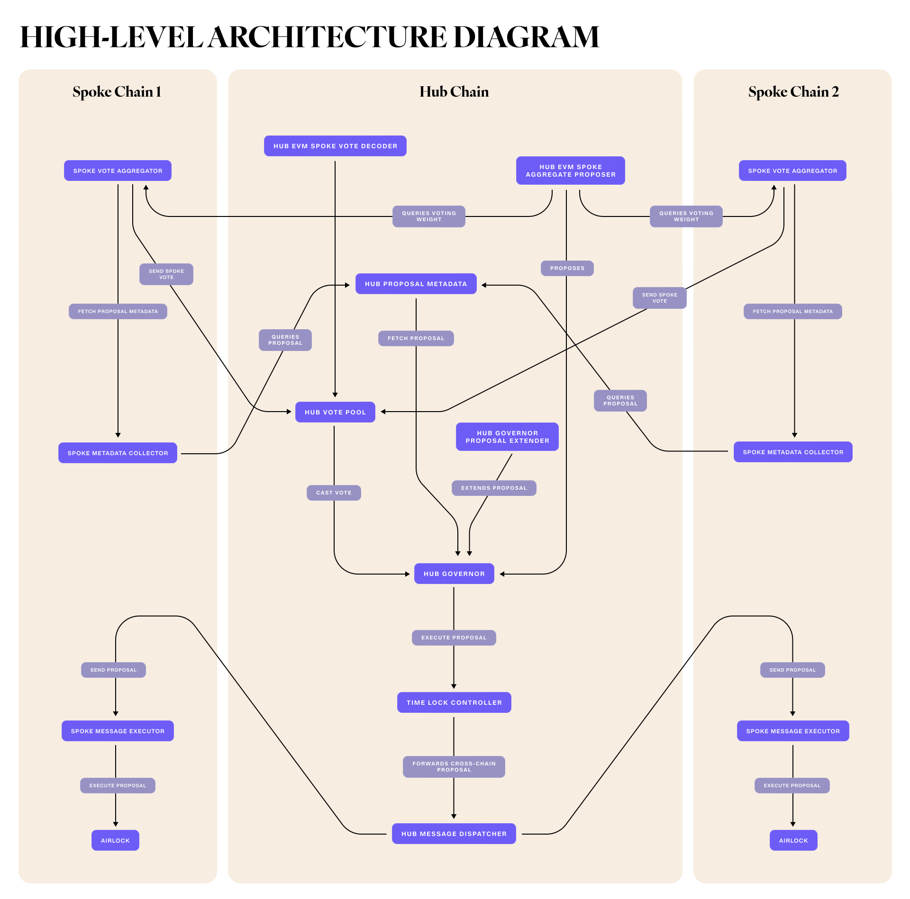

# MultiGov: Cross-Chain Governance with Wormhole

Welcome to the MultiGov docs! This first section provides an overview of MultiGov. Feel free to jump to any of the other sections in the table of contents below:

## Table of Contents
1. [Overview](#Overview)
2. [Getting Started](./getting-started.md)
3. [Deployment](./deployment/README.md)
4. [Upgrading](./upgrading.md)
5. [Architecture](./architecture.md)
6. [Guides](./guides.md)
7. [FAQs](./faqs.md)

## Overview

### What is MultiGov and why is it important?

MultiGov is a cross-chain governance system that extends traditional DAO governance across multiple blockchain networks. By leveraging Wormhole's interoperability infrastructure, MultiGov enables seamless voting and proposal mechanisms across various chains.

MultiGov is important because it:
- **Increases participation** by allowing token holders from multiple chains to engage in governance
- **Enhances security** by leveraging Wormhole's robust cross-chain communication
- **Improves scalability** by integrating any chain supported by Wormhole
- **Enables unified governance** and coordinated decision-making across multiple networks

### Key Features

- **Hub and Spoke Model**: Central coordination on a hub chain with participation from multiple spoke chains. A hub chain is the chain where governance state lives while the spoke chains can be thought of as extensions of governance that allow for participation by token holders on other chains.
- **Cross-Chain Voting**: Token holders on any integrated chain can cast votes
- **Vote Aggregation**: Votes from all chains are collected and tallied on the hub
- **Cross-Chain Proposal Execution**: Approved proposals can be executed across multiple chains
- **Wormhole Integration**: Secure and reliable cross-chain communication
- **Flexible Architecture**: Can integrate with any Wormhole-supported blockchain

### High-Level Architecture Diagram

<figure><figcaption></figcaption></figure>