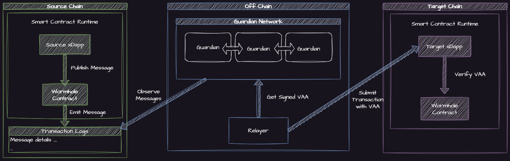

# What Is Wormhole?

Wormhole is a generic **message passing protocol** that enables communication between blockchains.

At a high level, this is accomplished in a few phases:

1. On the **Source Chain** a contract calls the [**Wormhole Core Contract**](../guide/components/core-contracts.md) which emits a message.
2. From **Off chain**

   a) The nodes in the **[Guardian](../guide/components/guardian.md) Network** validate the message and sign an attestation (or [**VAA**](../guide/components/vaa.md)).

   b) A [**Relayer**](../guide/components/relayer.md) picks up the **VAA** and relays it to the **Target Chain**.

3. On the **Target Chain**, the **VAA** is verified and some action is taken based on the payload.

This simple message passing protocol enables developers and users of [xDapps](../reference/glossary.md#xdapps) built by developers to escape the confines of a single ecosystem.

## What Isn't Wormhole?

- Wormhole is _not_ a blockchain itself, it provides a means of commination between blockchains or rollups.
- Wormhole is _not_ a token bridge, though there are [protocols built on Wormhole](./ecosystem/token-bridge.md) that service this purpose.
- Wormhole is _not_ an actual wormhole, its just software. Plus you'd need a supply of [Negative Energy](https://en.wikipedia.org/wiki/Negative_energy#Wormholes) to keep it open.

# The Case For Blockchain Interoperability

Because blockchains are siloed by nature, dapps built on a single chain will be constrained by the resources, features, and scale available within that single ecosystem.

With Wormhole, dapps can take advantage of the features and resources of any chain supported by Wormhole. The dapps that integrate wormhole are referred to as [xDapps](../reference/glossary.md#xdapp).

## Advantages of xDapps

Consider the following list describing some of the advantages of xDapps:

- **Expanded User Base** - Rather than being limited to the users of one blockchain, any user on any blockchain in the ecosystem can interact with an xDapp.
- **Increased Extensibility and Composability** - xDapps can utilize anything across the ecosystem, including other xDapps, expanding upon the composability and openness of smart contracts.
- **Decentralization** - Cross-chain solutions today usually involve centralized exchanges or bridges. However, Wormhole has been designed to be decentralized from day one, and eventually totally trustless.
- **Increased Performance** - xDapps are able to utilize the strengths of each blockchain. With xDapps, expensive computations can be offloaded onto high-performance platforms, final settlement can take place on a preferred chain, and data can be stored wherever is cheapest.
- **Unified Liquidity** - Liquidity fragmentation is a major problem in the current ecosystem. Unlike traditional tokens, xAssets can be pooled and moved anywhere.
- **Broader Market Reach** - Because xAssets move freely through the ecosystem, they can be listed on a variety of exchanges and custodied on any blockchain.
- **Future proofing** - As new environments and protocols join the decentralized ecosystem, the connected nature of the Wormhole ecosystem allows existing protocols to expand and support them.

<!-- TODO: can we say exponential? reword -->

With Wormhole and xDapps, the design space and scale possible for decentralized applications grows as each new chain is connected.

<!-- TODO: credit for wikipedia image -->

Consider the following examples of potential applications that are now possible with Wormhole:

1. Cross chain exchange: Using [Wormhole Connect](../guide/tutorials/quick-start/wh-connect.md), a developer can build an exchange that allows deposits from any Wormhole connected chain, massively increasing the liquidity their users can access.
2. Cross chain governance: If a group of NFT collections on different networks wanted their holders to vote on a combined proposal, they could pick a "voting" chain, and use Wormhole to communicate votes cast on their disparate chains to the voting chain.
3. Cross chain game: A game could be built and played on a performant network like Solana, and it's rewards issued as NFTs on a different network, for example Ethereum.

## Supported Blockchains

Wormhole already supports a number of Blockchain [Environments](../reference/environments/README.md)

### Currently Supported Blockchains

<table data-view="cards" data-full-width="false">
   <thead>
      <tr>
         <th></th>
         <th data-hidden data-card-target data-type="content-ref"></th>
         <th data-hidden data-card-cover data-type="files"></th>
      </tr>
   </thead>
   <tbody>
<!--SUPPORTED_BLOCKCHAIN_CARDS-->
<tr>
    <td><strong>Acala</strong></td>
    <td><a href="../reference/environments/evm.md#acala">evm.md</a></td>
    <td><a href="../.gitbook/assets/chain-icons/acala.svg">acala</a></td>
</tr>
<tr>
    <td><strong>Algorand</strong></td>
    <td><a href="../reference/environments/algorand.md#algorand">algorand.md</a></td>
    <td><a href="../.gitbook/assets/chain-icons/algorand.svg">algorand</a></td>
</tr>
<tr>
    <td><strong>Aptos</strong></td>
    <td><a href="../reference/environments/aptos.md#aptos">aptos.md</a></td>
    <td><a href="../.gitbook/assets/chain-icons/aptos.svg">aptos</a></td>
</tr>
<tr>
    <td><strong>Arbitrum</strong></td>
    <td><a href="../reference/environments/evm.md#arbitrum">evm.md</a></td>
    <td><a href="../.gitbook/assets/chain-icons/arbitrum.svg">arbitrum</a></td>
</tr>
<tr>
    <td><strong>Aurora</strong></td>
    <td><a href="../reference/environments/evm.md#aurora">evm.md</a></td>
    <td><a href="../.gitbook/assets/chain-icons/aurora.svg">aurora</a></td>
</tr>
<tr>
    <td><strong>Avalanche</strong></td>
    <td><a href="../reference/environments/evm.md#avalanche">evm.md</a></td>
    <td><a href="../.gitbook/assets/chain-icons/avalanche.svg">avalanche</a></td>
</tr>
<tr>
    <td><strong>Base</strong></td>
    <td><a href="../reference/environments/evm.md#base">evm.md</a></td>
    <td><a href="../.gitbook/assets/chain-icons/base.svg">base</a></td>
</tr>
<tr>
    <td><strong>BNB Smart Chain (BSC)</strong></td>
    <td><a href="../reference/environments/evm.md#bsc">evm.md</a></td>
    <td><a href="../.gitbook/assets/chain-icons/bsc.svg">bsc</a></td>
</tr>
<tr>
    <td><strong>btc</strong></td>
    <td><a href="../reference/environments/btc.md#btc">btc.md</a></td>
    <td><a href="../.gitbook/assets/chain-icons/btc.svg">btc</a></td>
</tr>
<tr>
    <td><strong>Celo</strong></td>
    <td><a href="../reference/environments/evm.md#celo">evm.md</a></td>
    <td><a href="../.gitbook/assets/chain-icons/celo.svg">celo</a></td>
</tr>
<tr>
    <td><strong>Ethereum</strong></td>
    <td><a href="../reference/environments/evm.md#ethereum">evm.md</a></td>
    <td><a href="../.gitbook/assets/chain-icons/ethereum.svg">ethereum</a></td>
</tr>
<tr>
    <td><strong>Fantom</strong></td>
    <td><a href="../reference/environments/evm.md#fantom">evm.md</a></td>
    <td><a href="../.gitbook/assets/chain-icons/fantom.svg">fantom</a></td>
</tr>
<tr>
    <td><strong>Gnosis</strong></td>
    <td><a href="../reference/environments/evm.md#gnosis">evm.md</a></td>
    <td><a href="../.gitbook/assets/chain-icons/gnosis.svg">gnosis</a></td>
</tr>
<tr>
    <td><strong>Injective</strong></td>
    <td><a href="../reference/environments/injective.md#injective">injective.md</a></td>
    <td><a href="../.gitbook/assets/chain-icons/injective.svg">injective</a></td>
</tr>
<tr>
    <td><strong>Karura</strong></td>
    <td><a href="../reference/environments/evm.md#karura">evm.md</a></td>
    <td><a href="../.gitbook/assets/chain-icons/karura.svg">karura</a></td>
</tr>
<tr>
    <td><strong>Klaytn</strong></td>
    <td><a href="../reference/environments/evm.md#klaytn">evm.md</a></td>
    <td><a href="../.gitbook/assets/chain-icons/klaytn.svg">klaytn</a></td>
</tr>
<tr>
    <td><strong>Moonbeam</strong></td>
    <td><a href="../reference/environments/evm.md#moonbeam">evm.md</a></td>
    <td><a href="../.gitbook/assets/chain-icons/moonbeam.svg">moonbeam</a></td>
</tr>
<tr>
    <td><strong>NEAR</strong></td>
    <td><a href="../reference/environments/near.md#near">near.md</a></td>
    <td><a href="../.gitbook/assets/chain-icons/near.svg">near</a></td>
</tr>
<tr>
    <td><strong>Neon</strong></td>
    <td><a href="../reference/environments/evm.md#neon">evm.md</a></td>
    <td><a href="../.gitbook/assets/chain-icons/neon.svg">neon</a></td>
</tr>
<tr>
    <td><strong>Oasis</strong></td>
    <td><a href="../reference/environments/evm.md#oasis">evm.md</a></td>
    <td><a href="../.gitbook/assets/chain-icons/oasis.svg">oasis</a></td>
</tr>
<tr>
    <td><strong>Optimisim</strong></td>
    <td><a href="../reference/environments/evm.md#optimism">evm.md</a></td>
    <td><a href="../.gitbook/assets/chain-icons/optimism.svg">optimism</a></td>
</tr>
<tr>
    <td><strong>Osmosis</strong></td>
    <td><a href="../reference/environments/osmosis.md#osmosis">osmosis.md</a></td>
    <td><a href="../.gitbook/assets/chain-icons/osmosis.svg">osmosis</a></td>
</tr>
<tr>
    <td><strong>Polygon</strong></td>
    <td><a href="../reference/environments/evm.md#polygon">evm.md</a></td>
    <td><a href="../.gitbook/assets/chain-icons/polygon.svg">polygon</a></td>
</tr>
<tr>
    <td><strong>pythnet</strong></td>
    <td><a href="../reference/environments/pythnet.md#pythnet">pythnet.md</a></td>
    <td><a href="../.gitbook/assets/chain-icons/pythnet.svg">pythnet</a></td>
</tr>
<tr>
    <td><strong>Sei</strong></td>
    <td><a href="../reference/environments/sei.md#sei">sei.md</a></td>
    <td><a href="../.gitbook/assets/chain-icons/sei.svg">sei</a></td>
</tr>
<tr>
    <td><strong>sepolia</strong></td>
    <td><a href="../reference/environments/evm.md#sepolia">evm.md</a></td>
    <td><a href="../.gitbook/assets/chain-icons/sepolia.png">sepolia</a></td>
</tr>
<tr>
    <td><strong>Solana</strong></td>
    <td><a href="../reference/environments/solana.md#solana">solana.md</a></td>
    <td><a href="../.gitbook/assets/chain-icons/solana.svg">solana</a></td>
</tr>
<tr>
    <td><strong>Sui</strong></td>
    <td><a href="../reference/environments/sui.md#sui">sui.md</a></td>
    <td><a href="../.gitbook/assets/chain-icons/sui.svg">sui</a></td>
</tr>
<tr>
    <td><strong>Terra</strong></td>
    <td><a href="../reference/environments/cosmwasm.md#terra">cosmwasm.md</a></td>
    <td><a href="../.gitbook/assets/chain-icons/terra.svg">terra</a></td>
</tr>
<tr>
    <td><strong>Terra2</strong></td>
    <td><a href="../reference/environments/cosmwasm.md#terra2">cosmwasm.md</a></td>
    <td><a href="../.gitbook/assets/chain-icons/terra2.svg">terra2</a></td>
</tr>
<tr>
    <td><strong>xpla</strong></td>
    <td><a href="../reference/environments/xpla.md#xpla">xpla.md</a></td>
    <td><a href="../.gitbook/assets/chain-icons/xpla.svg">xpla</a></td>
</tr>
<!--SUPPORTED_BLOCKCHAIN_CARDS-->
</tbody></table>

# Design Documents

Wormhole's components are designed via specifications that can be found [here](https://github.com/wormhole-foundation/wormhole/tree/main/whitepapers). These outline the reasoning behind design decisions and details specifics in more technical depth.
