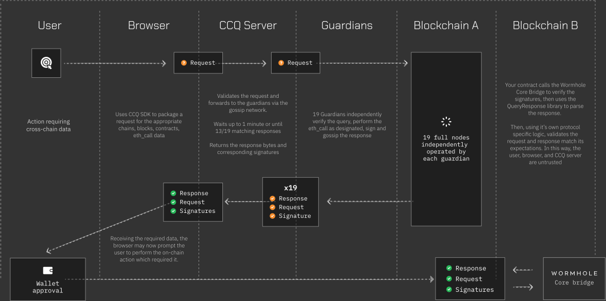

# Overview

> 💡 Queries are currently in closed-beta, though you can start developing today! Check out [Getting Started](./getting-started.md) and reach out to [Join the Beta](https://forms.clickup.com/45049775/f/1aytxf-10244/JKYWRUQ70AUI99F32Q)

Wormhole Queries offer on-demand access to guardian-attested on-chain data.

The current implementation offers integrators a simple REST endpoint to initiate an off-chain request via a proxy which handles forwarding the request to the guardians and gathering a quorum of responses. The result consists of the encoded response (which includes the request details) along with the guardian signatures. These can then be verified on-chain.

Read more about Queries in the [whitepaper](https://github.com/wormhole-foundation/wormhole/blob/main/whitepapers/0013_ccq.md).

## The Flow of a Query

<figure><figcaption></figcaption></figure>

1. An off-chain process initiates a Query Request via HTTPS to the Query Proxy (a.k.a. CCQ Server) - e.g. a user clicks a button to interact with a contract which requires cross-chain data.
2. The Query Proxy validates the request and forwards it to the guardians via a gossip network.
3. The Guardians independently validate the request, make the requisite RPC calls, verify the results, sign, and gossip a response back to the Query Proxy.
4. The Query Proxy aggregates the results and returns a response when it reaches quorum - 2/3+ of the current guardian set - the same quorum requirements as the core bridge.
5. The off-chain process can then submit these to an on-chain contract which should verify the signatures and validate the request before processing the result.

In the flow above, the Query Proxy serves as a permissioned but trustless part of the protocol.

In most cases, this entire process takes less than one second! In the case where a request is invalid or cannot be successfully processed by the guadians, they will retry for up to one minute before timing out.

Requests can be batched to have the guardians make multiple calls to multiple networks. This can further reduce overhead for processing query responses on-chain.

Up to 255 queries can be batched together, with certain types allowing for batching themselves.

## Supported Query Types

There are currently 3 supported types of queries. See [the whitepaper](https://github.com/wormhole-foundation/wormhole/blob/main/whitepapers/0013_ccq.md) for more details on each.

### eth_call

Effectively an equivalent of [eth_call](https://ethereum.org/en/developers/docs/apis/json-rpc/#eth_call) against a block specified by number or hash.

Calls are batched to allow specifying multiple calls (even to multiple contracts) against the same block. These will be done in the same batch RPC call and are easier for the requestor to verify on chain. Up to 255 calls may be batched in an single `eth_call` query.

The result contains the specified block number, hash, and timestamp along with the call result(s).

### eth_call By Timestamp

This query type is similar to `eth_call` but targets a timestamp instead of a specific block_id. This can be useful when forming requests based on uncorrelated data, such as requiring data from another chain based on the block timestamp of a given chain.

The result additionally contains the target and following block details with the following condition enforced.

```
target_block.timestamp <= target_time < following_block.timestamp
and
following_block_num - 1 == target_block_num
```

### eth_call With Finality

This query type is similar to `eth_call` but ensures that the specified block has reached the specified finality before returning the query results. The finality may be `finalized` or `safe`. Note that in the case that a chain does not natively support the `safe` tag, this will be equivalent to `finalized`.

## Supported Chains

The following table provides expected support based on testing. However, the success of any given query is based on the success of the underlying call on each guardian’s RPC node.

For example, many chains have implementations forked from [geth](https://github.com/ethereum/go-ethereum), which keeps 128 blocks of state in memory by default (without running in archive mode). While this is good for about 25 minutes of history on Ethereum mainnet, it is only about 3 minutes on Optimism. While guardian nodes can be expected to have access to recent state, there are currently no guarantees of how far back in history they have access to.

### Mainnet

| Chain         | Wormhole Chain ID | eth_call | By Timestamp        | With Finality | Expected History |
| ------------- | ----------------- | -------- | ------------------- | ------------- | ---------------- |
| Ethereum      | 2                 | ✅       | ✅                  | ✅            | 128 blocks       |
| BSC           | 4                 | ✅       | ✅                  | ✅            | 128 blocks       |
| Polygon       | 5                 | ✅       | ✅                  | ✅            | 128 blocks       |
| Avalanche     | 6                 | ✅       | ✅                  | ✅            | 32 blocks        |
| Oasis Emerald | 7                 | ✅       | ✅                  | ✅            | archive          |
| Fantom        | 10                | ✅       | ✅                  | ✅            | 16 blocks        |
| Karura        | 11                | ✅       | ✅                  | ✅            | archive          |
| Acala         | 12                | ✅       | ✅                  | ✅            | archive          |
| Klaytn        | 13                | ✅       | ✅                  | ✅            | 128 blocks       |
| Celo          | 14                | ✅       | ℹ️ hints required\* | ✅            | 128 blocks       |
| Moonbeam      | 16                | ✅       | ℹ️ hints required\* | ✅            | 256 blocks       |
| Arbitrum One  | 23                | ✅       | ✅                  | ✅            | \~6742 blocks    |
| Optimism      | 24                | ✅       | ✅                  | ❌            | 128 blocks       |
| Base          | 30                | ✅       | ✅                  | ✅            | archive          |

\*EthCallByTimestamp arguments for `targetBlock` and `followingBlock` are currently required for requests to be successful on these chains.

### Testnet

See the [Constants Reference](../reference/constants) for the list of testnet chains.
