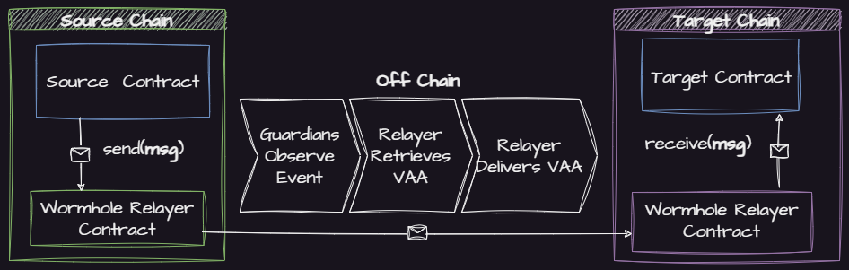

# Developing Cross Chain Applications

If you haven't read the Wormhole [introduction](https://docs.wormhole.com/wormhole/) to understand what Cross Chain Development is and how developers and Dapps can benefit from it, please start there. 

[VAAs](https://docs.wormhole.com/wormhole/explore-wormhole/vaa) are the core messaging primitive in Wormhole. You can think of them as packets of cross chain data that are emitted any time a cross chain application contract interacts with the Core Contract.

[Relayers](https://docs.wormhole.com/wormhole/explore-wormhole/relayer) in the Wormhole context are processes that deliver Verifiable Action Approvals (VAAs) to their destination, playing a crucial role in Wormhole's security model. They can't compromise security, only liveness, and act as delivery mechanisms for VAAs without the capacity to tamper with the outcome.

When building a cross chain application There are two primary ways to relay messages (VAAs) with Wormhole.

1. [Automatic Relaying](cross-chain-dev.md#automatic-relaying) - No off chain code required
2. [Specialized Relaying](cross-chain-dev.md#specialized-relayer) - Some off chain code may be required


The components outlined in **blue** are those that must be implemented by the developer


### Automatic Relaying


Automatic Relaying is currently only supported for EVM environments.


With Automatic Relaying, only the contracts need to be developed. Leave the message delivery to a service provider.

[Quick Start](automatic-relayer.md)

### Specialized Relayer

With Specialized Relaying, the developer can communicate with [any blockchain Wormhole supports](../reference/environments/README.md) and has the freedom to choose a delivery strategy.

[Quick Start](specialized-relayer.md)

### More

More tutorials are available [here](../tutorials/).
