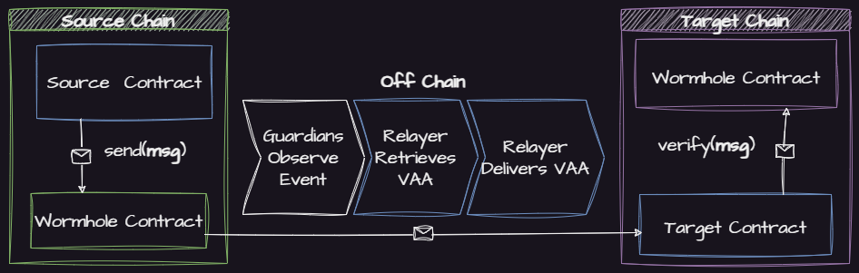

# Cross-chain Development

There are two primary ways to enable communication across chains with Wormhole.

1. [Automatic Relaying](cross-chain-dev.md#automatic-relaying) - No off chain code required
2. [Specialized Relaying](cross-chain-dev.md#specialized-relayer) - Some off chain code may be required


The components outlined in **blue** are those that must be implemented by the developer


### Automatic Relaying


Automatic Relaying is currently only supported for EVM environments.


With Automatic Relaying, only the contracts need to be developed. Leave the message delivery to a service provider.

[Quick Start](automatic-relayer.md)

### Specialized Relayer

With Specialized Relaying, the developer can communicate with [any blockchain Wormhole supports](broken-reference) and has the freedom to choose a delivery strategy.

[Quick Start](specialized-relayer.md)

### More

More tutorials are available [here](../tutorials/).
