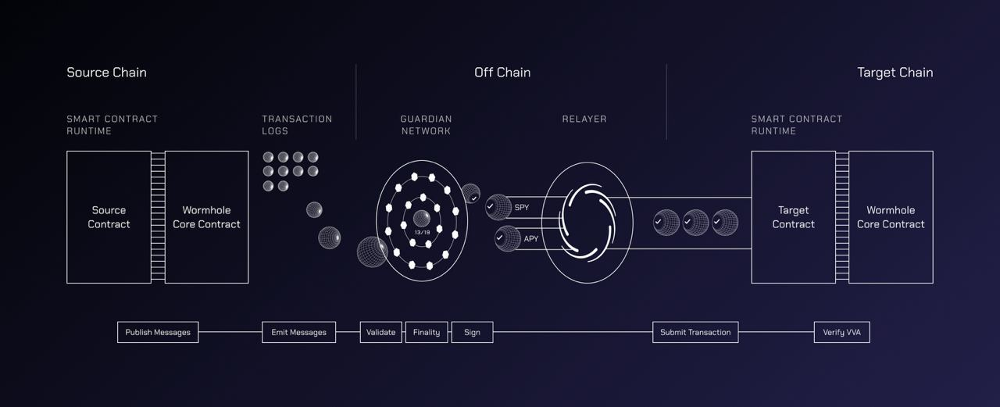

# Architecture

Wormhole is comprised of several noteworthy components. Before we go into each component in depth, let's talk about the names of the major pieces and how they fit together.

## On-Chain Components

- **Emitter** - A contract that calls the publish message method on the Core Contract. The core contract will write an event to the Transaction Logs with details about the emitter and sequence number to identify the message.  This may be your [xDapp](../glossary.md#xdapp) or an existing ecosystem protocol.

  Some existing contracts that are Emitters:

  - **xAsset Contracts** - Contracts that allow normal tokens to be converted to [xAssets](../glossary.md#xassets) and enable these xAssets to be bridged.
  - **Relay Contracts** - Contracts that allow cross chain applications to send messages to a specific blockchain via the decentralized Generic Relayer network.
  - **Worm Router Contracts** - Contracts that allow developers to make their Dapp an cross chain application that users on any Wormhole supported chain can interact with purely through client-side code.

- [**Wormhole Core Contract**](./core-contracts.md) - Primary contract, this is the contract which the Guardians observe and which fundamentally allow for cross-chain communication. 
- **Transaction Logs** - Blockchain specific logs that allow the Guardians to observe messages emitted by the core contract.

# Off-Chain Components

- **Guardian Network** - Validators that exist in their own P2P network. Guardians observe and validate the messages emitted by the Core Contract on each supported chain to produce VAAs (signed messages).

- [**Guardian**](./guardian.md) - One of 19 validators in the Guardian Network that contributes to the VAA multisig.

- [**Spy**](./spy.md) - A daemon that subscribes to messages published within the Guardian Network. A Spy can observe and forward network traffic, which helps scale up VAA distribution. 

- [**API**](../api-docs/README.md) - A REST server to retrieve details for a VAA or the guardian network.

- [**VAAs**](./vaa.md) - Verifiable Action Approvals (VAAs) are the signed attestation of an observed message from the wormhole core contract.

- [**Relayer**](./relayer.md) - Any off chain process that relays a VAA to the target chain. 

  - [**Standard Relayers**](./relayer.md#standard-relayers) - A decentralized relayer network which delivers messages that are requested on-chain via the Wormhole Relay Contract. Also referred to as `Generic Relayers`
  - [**Specialized Relayers**](./relayer.md#specialized-relayers) - Relayers that only handle VAAs for a specific protocol or cross chain application. They can execute custom logic off-chain, which can reduce gas costs and increase cross-chain compatibility. Currently, cross chain application developers are responsible for developing and hosting specialized relayers.
