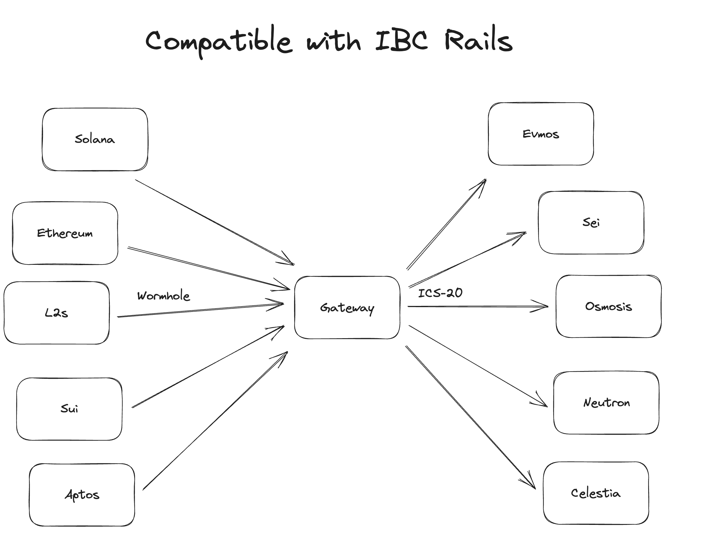
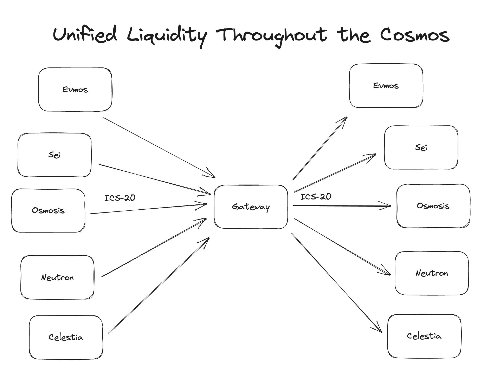


Note: This page is a work in progress, check back for updates


## Overview

_Wormhole Gateway_ is a Cosmos-SDK chain that provides a way to bridge non-native assets to the Cosmos ecosystem and serves as a source for unified liquidity across Cosmos chains.


Because IBC is used to bridge assets from Gateway to Cosmos chains, liquidity fragmentation is avoided and liquidity for foreign assets bridged via Wormhole into Cosmos is unified across Cosmos chains.


In addition to facilitating asset transfers, the Gateway allows Wormhole to monitor asset balances across chains to ensure [proper accounting](https://github.com/wormhole-foundation/wormhole/blob/main/whitepapers/0011_accountant.md). Additional protection is also provided with the [governor](https://github.com/wormhole-foundation/wormhole/blob/main/whitepapers/0007_governor.md).


## Integration

Integration with Wormhole Gateway can be accomplished with a few lines of code.

<!-- TODO: change branch to `main` once merged -->

To bridge assets into a Cosmos chain, an asset transfer is initiated on the foreign chain with a [payload](https://github.com/wormhole-foundation/wormhole/blob/gateway-integration/cosmwasm/contracts/ibc-translator/src/msg.rs#L73-L86) that is understood by the Gateway. Once received by the Gateway, the asset's CW20 representation is sent to the destination chain through IBC using the well established [ICS20 protocol](https://github.com/cosmos/ibc/tree/main/spec/app/ics-020-fungible-token-transfer).

To bridge assets out of the Cosmos ecosystem or between Cosmos chains, an IBC transfer is initiated on the source chain to the Gateway with a payload containing details about the transfer.

In short:

- The Wormhole protocol can be used to bridge assets from foreign chains to Gateway.
- The IBC protocol is used to bridge assets from Gateway to Cosmos chains.

<!-- TODO: better diagrams for showing flow of assets/messages -->




### Into Cosmos

To bridge assets from a foreign chain to a Cosmos chain, initiate a Wormhole transfer on the source chain with an additional payload. For example, with the Wormhole SDK:
<!-- TODO: need ibc translator addr -->

```ts
import * as wh from '@certusone/wormhole-sdk';

// ...

const transferDetails = {
  simple: {                      
    chain: 4000,                                    // Chain Id of the Cosmos chain we're sending to
    recipient: "<cosmos-chain-recipient-address>",  // Address of recipient
    fee: 0,                                         // Fee for transfer (0 for now)
    nonce: 0,                                        
  }
}

// Convert the transfer details to a Uint8Array for sending
const payload = new Uint8Array(Buffer.from(JSON.stringify(transferDetails)))

// Send transfer transaction on Ethereum
await txReceipt = wh.transferFromEth(
  wh.consts.TESTNET.eth.token_bridge    // source chain token bridge address
  wallet,                               // signer for eth tx
  "0xdeadbeef...",                      // address of token being transferred
  10000000n,                            // amount of token in it's base units
  wh.consts.CHAINS.wormchain,           // chain id we're sending to
  "<ibc-translator-contract-addr>",     // The address of the ibc-translator contract on the Gateway
  0,                                    // relayer fee, 0 for now
  {},                                   // tx overrides (gas fees, etc...)
  payload                               // The payload Gateway uses to route transfers
);

// ...
```

### Out of Cosmos

To bridge assets back out from a Cosmos chain to a foreign chain, initiate an IBC transfer on the source chain with a formatted payload in the `memo` field. For example, using [cosmjs](https://github.com/cosmos/cosmjs):

```ts
const wallet = await DirectSecp256k1HdWallet.fromMnemonic(faucet.mnemonic);
const client = await SigningStargateClient.connectWithSigner(
  simapp.tendermintUrl,
  wallet,
  defaultSigningClientOptions
);

const memo = JSON.stringify({
    gateway_ibc_token_bridge_payload:{
        simple:{
            chain:     0,   // chain id of receiver
            recipient: "",  // address of receiver
            fee:       0,   // fee to cover transfer
            nonce:     0,   // 
        }
    }
})

const result = await client.sendIbcTokens(
  faucet.address0,                      // sender address
  "<ibc-translator-contract-addr>",     // receiver address 
  coin(1234, "ucosm"),                  // amount and coin
  "<port>",                             // source port
  "<channel>",                          // source channel
  timeoutHeight,                        // 
  timeoutTimestamp,                     // 
  0,                                    // fee to cover transaction 
  memo                                  // formatted payload with details about transfer
);
```

## More Details

The _Wormhole Gateway_ is, of course, open source and the source is available [here](https://github.com/wormhole-foundation/wormhole/tree/main/wormchain)

<!-- TODO: change branch to `main` once merged -->
The contracts that make this possible are available [here](https://github.com/wormhole-foundation/wormhole/tree/gateway-integration/cosmwasm/contracts)

A protocol description for generic message passing using the Gateway is available [here](https://github.com/wormhole-foundation/wormhole/blob/mainnet/whitepapers/0012_ibc_generic_messaging.md).

<!-- TODO: outdated?
For more details about the design, see the [design document](https://github.com/wormhole-foundation/wormhole/blob/gateway-integration/wormchain/design/design.md).

Also, the [roadmap](https://github.com/wormhole-foundation/wormhole/blob/gateway-integration/wormchain/design/roadmap.md) document provides information on future feature implementations.
-->
