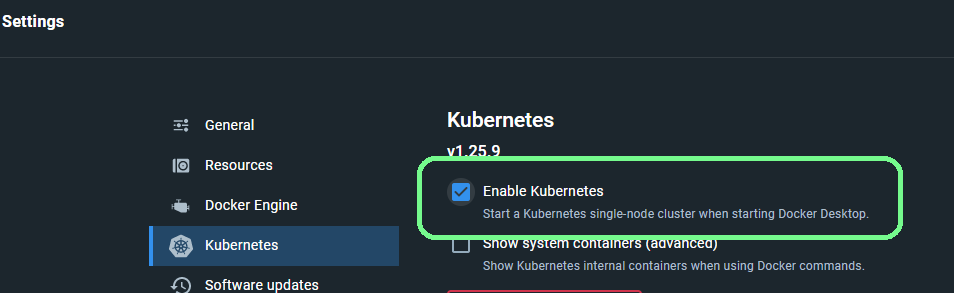

# Tilt


Tilt is often referred to as 'Devnet' in the Wormhole ecosystem so any information that is labeled as 'devnet' also applies to Tilt.


[Tilt](https://tilt.dev/) is part of the official Docker ecosystem. It's a tool which allows developers to easily configure a Kubernetes environment for development.

However, in the context of Wormhole, 'Tilt' refers to the development environment used by the [Wormhole Core Repository](https://github.com/wormhole-foundation/wormhole). This environment stands up docker images for all the tools necessary to build across multiple blockchains, including:

* All the Wormhole supported blockchains / ecosystems
* A Guardian Node
* Relayers
* Databases, Redis
* Utility front ends

The 'Tilt' environment is meant to provide an entire cross-chain development stack right out of the box.

#### Is Tilt Right for You?

Tilt is a good option for developers that need some local devnet and have access to a machine that can handle running them. It is a great option for developers that want to establish some CI testing suite.

**Pros**

* Out-of-the-box support for the many components needed to develop across the heterogeneous blockchain spaces.
* Consistent development environment, where contracts deploy deterministically and everything is already linked up.
* Ability to easily enable/disable components as needed.
* Regularly updated as new components join the Wormhole ecosystem.

**Cons**

* Relatively high system requirements but this can be mitigated by disabling components.
* Most blockchains are 'fresh' and have no contracts by default. Thus, if your contracts have any dependencies, you may have to deploy them yourself or alter the default tilt configuration.
* Spin-up and rebuild times can be slow which can result in a slow workflow.

### Setting up Tilt

Tilt functions best in a UNIX-style environment.

In order to run the Tilt environment, make sure you have [Tilt](https://docs.tilt.dev/install.html) and [Go](https://go.dev/doc/install) installed.

#### Prerequisites



You'll need to have `homebrew` on your system if you don't already. You can grab it with:

```sh
/bin/bash -c "$(curl -fsSL https://raw.githubusercontent.com/Homebrew/install/HEAD/install.sh)"
```

**Install Go**

```sh
brew install go
```

**Install Docker**

```sh
brew install docker
```

After installation, go into Docker settings and switch ON `kubernetes`. Also configure Docker to have 4 CPUs and \~16GB of RAM.

**Install Tilt**

```sh
brew install tilt
```



**Install Go**

```sh
wget https://go.dev/dl/go1.18.1.linux-amd64.tar.gz
rm -rf /usr/local/go && tar -C /usr/local -xzf go1.18.1.linux-amd64.tar.gz
```

**Install Docker**

If you're using Linux with a window manager, its highly recommended to install Docker Desktop since it comes with Kubernetes built in and you won't need to download `minikube`.

It's recommended to have at least 4 CPUs and 16GB RAM dedicated to Docker.

Also, make absolutely sure that you set up Docker as a non-root user.

[https://docs.docker.com/engine/install/ubuntu/#installation-methods](https://docs.docker.com/engine/install/ubuntu/#installation-methods)

**Docker Desktop (Recommended)**

Enable Kubernetes by going into Settings > Kubernetes



**CLI**

The alternative to Docker Desktop with Kubernetes is to install [`minikube`](https://minikube.sigs.k8s.io/docs/start/).

Configure minikube:

```sh
minikube start --driver=docker --kubernetes-version=v1.23.3 --cpus=4 --memory=14G --disk-size=10G --namespace=wormhole
```

If you reboot your VM you'll need to run the `minikube start` command again before you bring up tilt.

**Install Tilt**

Install Tilt by copy pasting this into the Terminal:

```sh
curl -fsSL https://raw.githubusercontent.com/tilt-dev/tilt/master/scripts/install.sh | bash
```



Linux Experimental Setup

**Experimental Setup Script**


This is only recommended if you're running headless Linux and unable to use Docker Desktop, as you can enable Kubernetes from Docker.


There's an experimental single command setup script that should install dependencies for you on Linux and configure everything properly.

```sh
curl $URL | sh install_linux.sh
cd wormhole/
./tilt.sh
```



If you've all got prerequisites installed, just clone the Wormhole Core Repository and start Tilt.

```sh
git clone --branch main https://github.com/wormhole-foundation/wormhole.git
cd wormhole
tilt up
```

<details>

<summary>Tilt in a VM</summary>

If you're running Tilt in a VM, you'll need to pass in some extra flags to enable Tilt to listen to incoming traffic from external addresses:

```sh
tilt up --host=0.0.0.0 -- --webHost=0.0.0.0
```

You can now access the Tilt UI at `vm_external_ip:10350`.

If the VM's external IP doesn't work, check firewall and port settings to make sure your VM allows incoming traffic.

</details>

Be sure to check out the [**Tiltfile**](https://github.com/wormhole-foundation/wormhole/blob/main/Tiltfile), which has much of the configuration and arguments for the development environment. It's relatively straightforward to enable and disable components.

For example, you can enable blockchains by setting them to true at startup


Note the use of the **--** separator between tilt command flags and the flags you wish to pass to configure the setup


```sh
tilt up -- --algorand --solana
```

### Using Tilt

Tilt can be treated as an external environment / testnet that you can easily spin up and tear down.

If you've followed the standard setup, all your resources will be bound to various ports on localhost. To see all the endpoints which are being hosted in your Tilt environment, you should check the Tilt dashboard, located at [http://localhost:10350/overview](http://localhost:10350/overview).

All the deployed contract addresses can be found under the 'Devnet' section of the chain being used in the [Environments](../../blockchain-environments/environments.md) pages.

Useful information pertaining to funded wallets & private keys can also be found in the [devnet.md](https://github.com/wormhole-foundation/wormhole/blob/main/docs/devnet.md) file of the docs.

Additional helpful resources can be found in the [Tooling](tooling.md) page.

### Shutting down Tilt

In order to shut down Tilt, run `tilt down` with the same network flags provided in the `tilt up` command.

```
tilt down -- --solana --algorand
```

### FAQ

#### Where are Fantom/Celo/Polygon/other EVM chains?

For all chains that support EVM, the smart contract development environment is effectively the same. For changes in gas costs and transaction times, consider testing contract logic on devnet and then using testnet environments to get chain-specific answers.

#### Solana is taking forever

Due to Solana's architecture, it often takes 25-40min to build the Solana pod. Consider increasing CPU cores assigned to devnet for a faster build.

#### Solana program deploy doesn't work

Kubernetes doesn't currently allow port forwarding for UDP ports ([Github Issue](https://github.com/kubernetes/kubernetes/issues/47862)), which is what Solana uses for `solana program deploy`. Instead, we recommend using [Solana Deployer](https://github.com/acheroncrypto/solana-deployer). Not only does this deploy programs over regular RPC (thus bypassing UDP port requirements), it's also much faster than `solana program deploy`.

#### Reset state for a pod

If you want to quickly iterate and don't want to bring Tilt down and back up, you can reset state for a pod by clicking the 🔄 button next to the pod name in Tilt UI.

## Contracts and Accounts

The devnet environment deploys the core layer and token bridge to each of the chains at the same addresses every time. It also provides specific wallets with funds.

### Default Ports

| Service            | Port |
| ------------------ | ---- |
| Guardian REST      | 7071 |
| Guardian gRPC Port | 7070 |
| Eth0 RPC           | 8545 |
| Eth1 RPC           | 8546 |
| Solana RPC         | 8899 |
