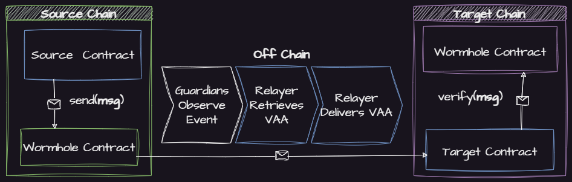

# Developing Cross Chain Dapps

If you haven't read the Wormhole [introduction](../../../README.md) to understand what Cross Chain Development is and how developers and Dapps can benefit from it, please start there.

[VAAs](../../../reference/components/vaa.md) are the core messaging primitive in Wormhole. You can think of them as packets of cross chain data that are emitted any time a cross chain application contract interacts with the Core Contract.

[Relayers](../../../reference/components/relayer.md) in the Wormhole context are processes that deliver Verifiable Action Approvals (VAAs) to their destination, playing a crucial role in Wormhole's security model. They can't compromise security, only liveness, and act as delivery mechanisms for VAAs without the capacity to tamper with the outcome.

When building a cross chain application, there are two primary ways to relay messages (VAAs) with Wormhole.

1. [Automatic Relaying](./#automatic-relaying) - No off chain code required
2. [Specialized Relaying](./#specialized-relayer) - Some off chain code may be required


The components outlined in **blue** are those that must be implemented by the developer


### Automatic Relaying


Automatic Relaying is currently only supported for EVM environments.


With Automatic Relaying, only the contracts need to be developed. Leave the message delivery to a service provider.

[Read More](standard-relayer.md)

[Quick Start](../hello-wormhole/README.md)

### Specialized Relayer

With Specialized Relaying, the developer can communicate with [any blockchain Wormhole supports](../../../blockchain-environments/README.md) and has the freedom to choose a delivery strategy.

[Read More](specialized-relayer.md)

[Quick Start](../relayer/README.md)

### More

More tutorials are available [here](../tutorials/).
