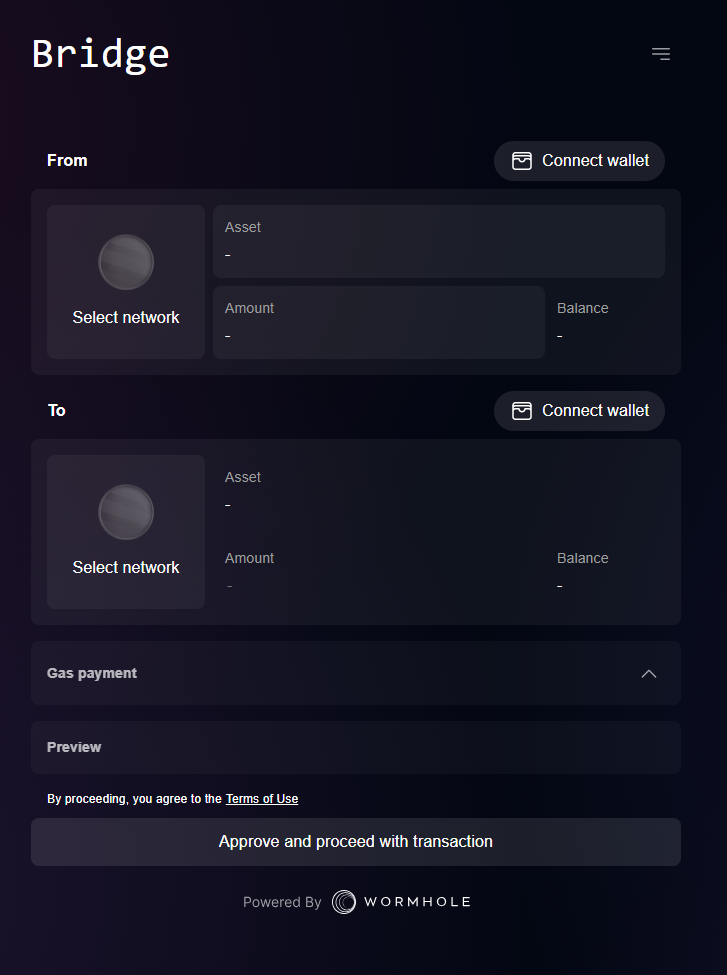

With Wormhole Connect, integration with wormhole is easier than ever.

[Github repository](https://github.com/wormhole-foundation/wormhole-connect)


## Ultra Quick Start

For the zero config quick start, simply include the script and style tags in the HTML of your web app.

1) Include the following html tags in the `<head>` of the html

```html
<script src="https://www.unpkg.com/@wormhole-foundation/wormhole-connect@0.0.1-beta.2/dist/main.js" defer></script>
<link rel="https://www.unpkg.com/@wormhole-foundation/wormhole-connect@0.0.1-beta.2/dist/main.css" />
```

2) Include the following div tag in the `<body>` of the html where the plugin should be rendered:

```html
<div id="wormhole-connect"></div>
```

3) **(Optional)** Touch Grass


## React App Integration 


Getting Wormhole Connect added to your existing React app is straight forward.

First, install the npm package

```sh
npm install @wormhole-foundation/wormhole-connect
```

Next, import the component

```ts
import WormholeBridge from '@wormhole-foundation/wormhole-connect';
```

Finally, add the component to your app

```tsx
function App() {
    return (
        <WormholeBridge />
    )
}
```

If your app is running, you should see something like this




## Configuration

The default configuration of Wormhole Connect may not be what you want to use.  You may want to provide custom styles or restrict the chains that you allow in your app.

One important set of configuration parameters you should consider changing are the RPC URLs. By default public RPCs are used but they're heavily throttled, so for best user experience, these should be set to custom URLs.

More details on configuration options available is [here](https://github.com/wormhole-foundation/wormhole-connect/blob/development/wormhole-connect-loader/README.md)




Configure the Wormhole Connect React component by passing a `WormholeConnectConfig` object as the `config` attribute

```tsx
import { WormholeConnectConfig } from '@wormhole-foundation/wormhole-connect';

const config: WormholeConnectConfig = {
  env: "mainnet",
  networks: ["ethereum", "polygon", "solana"],
  tokens: ["ETH", "WETH", "MATIC", "WMATIC"],
  rpc: {
    ethereum: "https://rpc.ankr.com/eth",
    solana: "https://rpc.ankr.com/solana",
  }
}

// ...

<WormholeBridge config={config} />

```




The same config parameters that are available for the React component can be passed as a json string to the `config` attribute of the `wormhole-connect` container.

```html
<div id="wormhole-connect" config='{"env":"mainnet","tokens":["ETH","WETH","WBTC","USDCeth"]}' />
```





<details>
<summary>Theme Options</summary>

More [here](https://github.com/wormhole-foundation/wormhole-connect/blob/development/wormhole-connect-loader/src/theme.ts)

```ts
export type Theme = {
  primary: PaletteColor;
  secondary: PaletteColor;
  divider: string;
  background: {
    default: string;
  };
  text: {
    primary: string;
    secondary: string;
  };
  error: PaletteColor;
  info: PaletteColor;
  success: PaletteColor;
  warning: PaletteColor;
  button: {
    primary: string;
    primaryText: string;
    disabled: string;
    disabledText: string;
    action: string;
    actionText: string;
    hover: string;
  };
  options: {
    hover: string;
    select: string;
  };
  card: {
    background: string;
    elevation: string;
    secondary: string;
  };
  popover: {
    background: string;
    elevation: string;
    secondary: string;
  };
  modal: {
    background: string;
  };
  font: {
    primary: string;
    header: string;
  };
};

```

</details>

<details>
<summary>Configuration Options</summary>

More [here](https://github.com/wormhole-foundation/wormhole-connect/blob/development/wormhole-connect-loader/src/types.ts)

```ts
export type Rpcs = {
  [chain in ChainName]?: string;
};

export interface BridgeDefaults {
  fromNetwork?: ChainName;
  toNetwork?: ChainName;
  token?: string;
  requiredNetwork?: ChainName;
}

export interface WormholeConnectConfig {
  env?: 'mainnet' | 'testnet';
  rpcs?: Rpcs;
  networks?: ChainName[];
  tokens?: string[];
  mode?: 'dark' | 'light';
  customTheme?: Theme;
  cta?: {
    text: string;
    link: string;
  };
  bridgeDefaults?: BridgeDefaults;
}
```

</details>